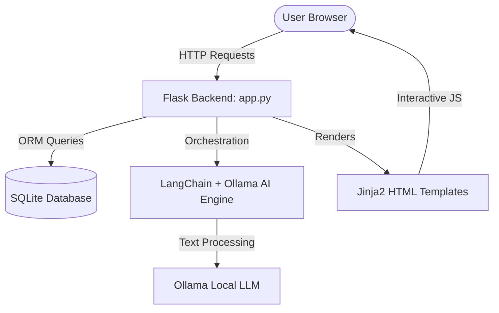

# GlobeTrotter AI - Premium Travel Ecosystem ✈️🌍

Welcome to **GlobeTrotter AI**, an advanced, gamified travel planner and community platform. It combines interactive itinerary builders, budget and expense tracking, a shared community feed, and an intelligent AI travel assistant powered by LangChain and Ollama.

---

## 📋 Prerequisites

Make sure you have **Python 3.8+** installed on your system.
* Check your version by running:
  ```bash
  python --version  # or python3 --version
  ```

---

## 🚀 How to Run the Website

Choose the installation instructions corresponding to your Operating System:

###  macOS / Linux Setup

1. **Open Terminal** and navigate to the project directory:
   ```bash
   cd Trip_Planner
   ```

2. **Create a virtual environment (Recommended):**
   ```bash
   python3 -m venv venv
   ```

3. **Activate the virtual environment:**
   ```bash
   source venv/bin/activate
   ```

4. **Install the dependencies:**
   ```bash
   pip install -r requirements.txt
   ```

5. **Run the application:**
   ```bash
   python3 app.py/app.py
   ```

6. **Open in browser:**
   Open [http://127.0.0.1:5001](http://127.0.0.1:5001) in your web browser.

---

### ⊞ Windows Setup

1. **Open Command Prompt (CMD) or PowerShell** and navigate to the project directory:
   ```cmd
   cd Trip_Planner
   ```

2. **Create a virtual environment (Recommended):**
   ```cmd
   python -m venv venv
   ```

3. **Activate the virtual environment:**
   * **Command Prompt:**
     ```cmd
     venv\Scripts\activate.bat
     ```
   * **PowerShell:**
     ```powershell
     venv\Scripts\Activate.ps1
     ```

4. **Install the dependencies:**
   ```cmd
   pip install -r requirements.txt
   ```

5. **Run the application:**
   ```cmd
   python app.py/app.py
   ```

6. **Open in browser:**
   Open [http://127.0.0.1:5001](http://127.0.0.1:5001) in your web browser.

---

## 🛑 How to Deactivate/Stop

* To stop the Flask server, press `Ctrl + C` in your terminal.
* To exit the virtual environment, run:
  ```bash
  deactivate
  ```

---

## ⚙️ How It Works (Technical Overview)

GlobeTrotter AI is built on a structured model-view-controller paradigm utilizing Flask on the backend, SQLite for data persistence, and a modern responsive frontend.



### 1. Core Architecture & MVC Flow
* **Backend Framework**: [app.py](file:///Users/ashokkumar/Downloads/Trip_Planner/app.py/app.py) handles routing, authentication (via Flask-Login), and business logic.
* **Database**: SQLite managed through Flask-SQLAlchemy. The relational schema supports user tables, trip segments, stops, activities, budgets, journals, social posts, and notifications.
* **Database Migrations**: Automatic table schema patching runs during initialization to add gamification fields (XP, Level, Points) to legacy schemas seamlessly.

### 2. Intelligent AI Travel Assistant
* **Engine Integration**: Powered by [ai_engine.py](file:///Users/ashokkumar/Downloads/Trip_Planner/app.py/ai_engine.py). It interfaces with LangChain's local Ollama LLM provider.
* **Document Processing**: Supports PDF uploads (e.g. flight itineraries or hotel confirmations). It uses `PyPDF` to parse textual content and feed it into vector indexes or prompt structures, summarizing and extracting stops automatically.
* **AI Planner Chat**: Users can interact in a stateful chat window to request customized destination guidelines, weather forecasts, or activity suggestions.

### 3. Interactive Planner & Budgeting
* **Itinerary Manager**: Drag-and-drop Stop sorting with dynamic daily scheduling.
* **Budget Tracking**: Computes overall planned budgets vs. actual expenses.
* **Document Exporters**:
  * PDF compiler using `ReportLab` to download printable itineraries.
  * CSV exporter for expense reports using `openpyxl` / python csv utility.

### 4. Travel Gamification Engine
* **Milestones & XP**: Users earn Experience Points (XP) for actions:
  * Creating a trip (+100 XP)
  * Adding an itinerary stop (+25 XP)
  * Logging a journal entry (+50 XP)
  * Completing packing lists or task items (+15 XP)
* **Level System**: Automatically computes user level: $\text{Level} = \lfloor\sqrt{\text{XP} / 100}\rfloor + 1$.
* **Achievements**: Triggers notifications and unlocks milestone badges (e.g., "Pioneer", "Historian", "Budget Master") saved under user credentials.
* **Leaderboard**: Compares levels globally across all registered users on the community tab.

### 5. Community Feed & Collaboration
* **Pinterest-style Grid**: Displays public travel plans, photo-sharing cards, and detailed journals shared by other users.
* **Cloning Itineraries**: Allows users to duplicate public itineraries into their personal workspace with one click.


run code in terminal

python -m venv venv
venv\Scripts\Activate.ps1
pip install -r requirements.txt
py app.py